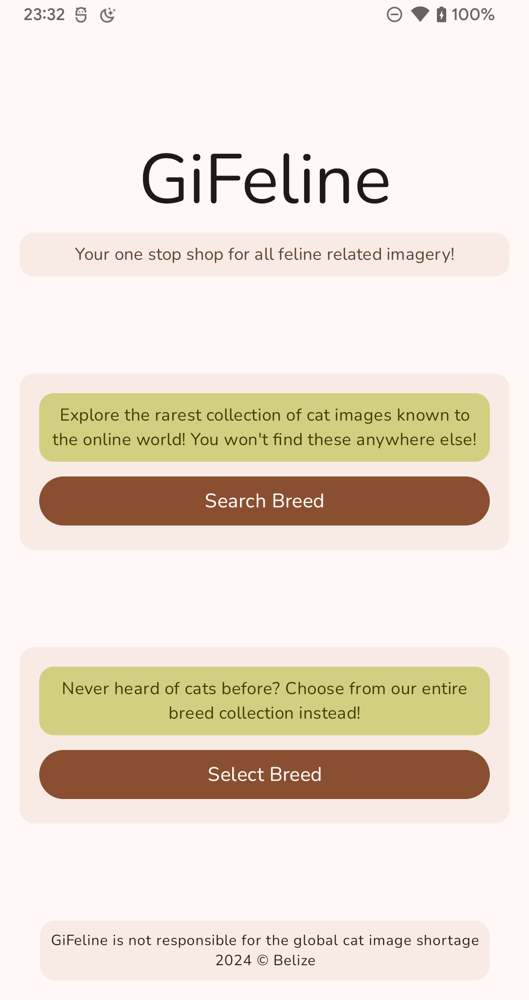
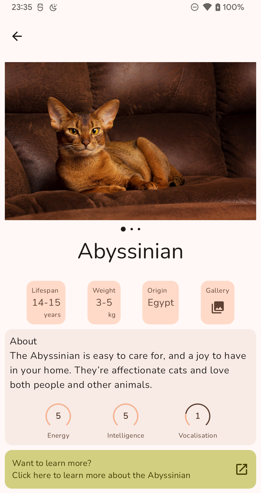
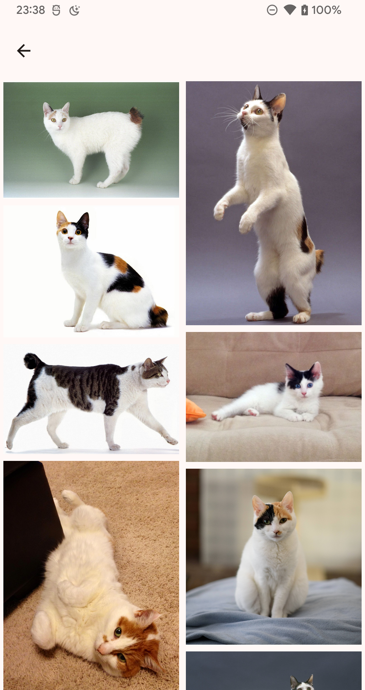
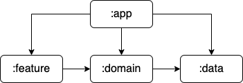

# GiFeline

When all online cat media "mysteriously" disappeared, one app shot to prominence as the only source 
of feline based imagery.

| Home                              | Breed                                 | Gallery                                 |
|-----------------------------------|---------------------------------------|-----------------------------------------|
|  |  |  |

GiFeline is an Android app surfacing data available from the [Cat Api](https://thecatapi.com/) 
utilising some of the more popular development frameworks and technologies including 
Kotlin, Coroutines and Flows, Compose, and Hilt.

## Architecture
GiFeline's architecture follows a very basic clean architecture pattern, with separate modules for 
the feature, domain, and data layers, and a single small application module.

Where A → B implies A has a dependency on B

Due to the small size and time constraints of this project, these modules haven't been broken down 
further into sub modules. However, the files have been organised into top level packages such that
the task of creating sub modules would be a simple one if the need becomes apparent.

In the **data** layer, the repository pattern is utilised to provide an abstraction layer to data sources.

In the **domain** layer, use cases are used to perform small business logic tasks.

In the **feature** layer, an MVI-like approach is used, where view states are created and exposed 
to awaiting composable screens.

## Technology

The application is 100% Kotlin, utilising Coroutines and Flows for asynchronous code execution and 
data transmitting (mostly for UI states).

### UI (Compose)
The entire UI of the application is constructed using Jetpack Compose, based off of a single activity.
Additional flair is provided to the UI via the animation libraries of compose, with the development 
of a custom loading spinner and breed stats.

Navigation is handled via compose routing, allowing for ViewModels to read navigation 
arguments via the SavedStateHandle.

Images are loaded through use of Coil's compose library, with a custom shimmer to indicate loading.

### Network
As is very common in the Android space, networking is achieved through the use of Retrofit and OkHttp3,
with the addition of Moshi to convert the responses from Json.

To allow for all api requests to be authenticated, interceptors were used to add on the required header.
Time permitting, better (and more secure) storage of the API key would be high on the priority list.

### Dependency Injection
Dependency Injection is achieved through the use of Hilt, mostly via constructor injection. The main
use of module based injection was for networking, to provide singleton instances of retrofit and okhttp3.

### Testing
The entire project is unit tested using JUnit 4, AssertJ, Mockk, and Turbine.

## Future improvements
There are several areas that I want to spend more time improving with this project. These include:

- **Network caching** - There is no network caching currently in this project. Ideally this could be 
achieved through OkHttp3 but could do something a bit more manual.
- **Utilising the breed stats further** - Only three hand selected stats were chosen for display, with so
many more available in the responses it could provide room for some fun design choices.
- **Font provider migration** - Using Google font providers seemed like a good idea initially, however it
has led to some interesting quirks where the preview and build versions differ in font design. 
I might move back to downloaded font files as they prove to be more consistent.
